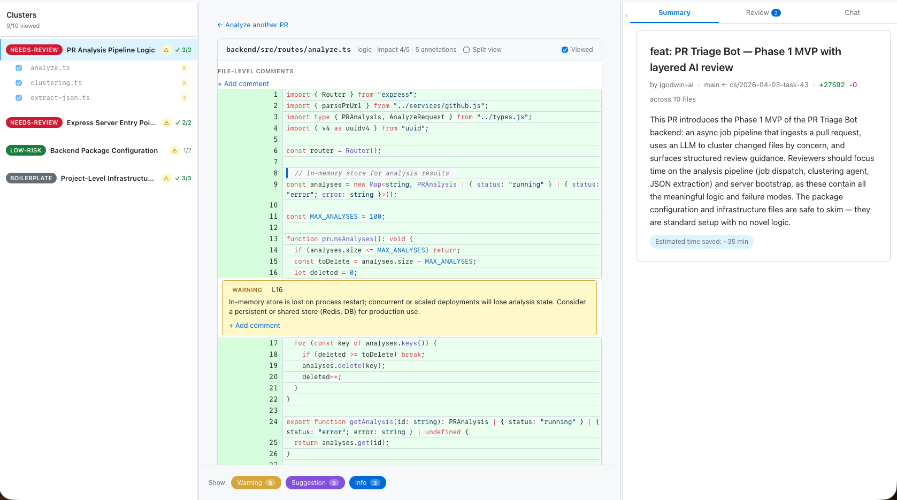

# PR Triage Bot

AI-layered code review for pull requests, built for the era of agent-authored PRs.



## What it does

Point it at a GitHub PR URL. The bot fetches every changed file, runs a three-stage
Claude pipeline over them, and drops you into a reviewing UI that's been pre-organized
and pre-annotated — so your time goes to the parts that actually need human judgement.

The pipeline:

1. **File analysis** — each changed file is summarized, scored for review impact, and
   annotated with inline warnings, suggestions, and info callouts.
2. **Clustering** — related files are grouped by concern (e.g. "analysis pipeline logic",
   "server bootstrap", "package configuration") so you can review by topic instead of
   by filename.
3. **Ranking & synthesis** — an executive summary calls out the highest-impact clusters,
   risks, and an estimate of how much reviewing time the triage just saved you.

## Why it's useful

Agent-committed PRs are big, fast, and often touch dozens of files at once. Scrolling
the GitHub diff one file at a time is the wrong tool for that workload:

- Mechanical changes (configs, fixtures, generated code) drown the signal from the
  3 files that actually contain the logic under review.
- Annotations live in your head, not on the code.
- There's no shared context as you jump between files.

PR Triage Bot front-loads the boring analysis: it tells you which clusters carry risk,
pre-highlights the lines worth a second look, and gives you a per-file chat pane to ask
Claude follow-up questions without leaving the review.

## Features

- **Three-pane reviewing UI**: cluster sidebar, diff viewer with inline annotations, and
  a right rail with tabs for the executive summary, your in-progress review comments,
  and a file-scoped chat.
- **Inline annotations** with warning / suggestion / info chips that filter in one click.
- **Per-file chat with Claude** for "why did the agent do this?" questions.
- **Draft review workflow** — collect file-level, line-level, and cluster-level comments,
  jump back to any of them, then submit the whole review to GitHub in one shot.
- **Analysis caching** so re-visiting the same PR is instant, and a dev shortcut on the
  landing page to load a cached analysis without re-running the pipeline.

## Repo layout

```
backend/    Express + TypeScript API. Pipeline, GitHub integration, WebSocket streaming.
frontend/   React + Vite UI.
docs/       Planning notes and skills.
```

## Running locally

```bash
# Backend (port 9000)
cd backend && npm install && npm run dev

# Frontend (port 5173)
cd frontend && npm install && npm run dev
```

You'll need a GitHub token with `repo` scope (read access is sufficient for public PRs).
The backend can use either the Claude Code CLI (default, no API key needed) or the
Anthropic SDK (set `ANTHROPIC_API_KEY`).
